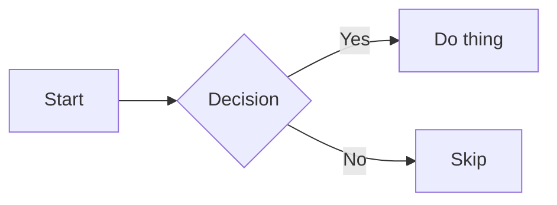
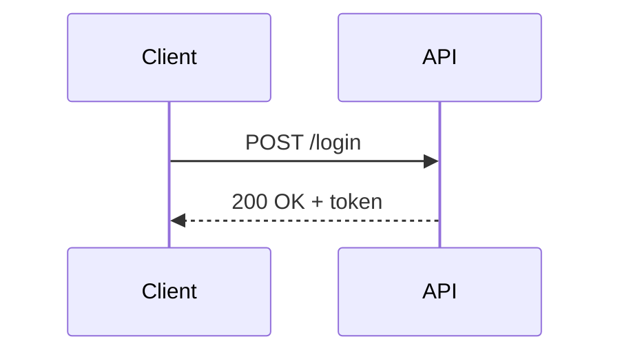

# VSCode — GitHub Flavored Markdown Preview

**Date:** 2026-04-13  
**Category:** environment  
**Tags:** `vscode`, `markdown`, `gfm`, `preview`, `extensions`  
**Related:** [vscode-markdown-preview-default-260413a.md](vscode-markdown-preview-default-260413a.md) · [vscode-keyboard-shortcuts-260413a.md](vscode-keyboard-shortcuts-260413a.md)

---

## TL;DR

- Install the **`bierner.github-markdown-preview`** extension pack — one install covers all GFM gaps
- Add `"markdown.previewFrontMatter": "show"` to `settings.json` to render YAML front matter
- The built-in preview already handles tables, strikethrough, and fenced code blocks — the pack fills in the rest

---

## What the Built-in Preview Covers

VSCode's built-in Markdown preview supports standard CommonMark plus some GFM basics:

| Feature | Built-in support |
|---------|-----------------|
| Headers, bold, italic, blockquotes | ✅ |
| Fenced code blocks with syntax highlighting | ✅ |
| Tables | ✅ |
| Strikethrough (`~~text~~`) | ✅ |
| Autolinks | ✅ |
| Task list checkboxes (`- [ ]`) | ⚠️ Rendered as plain text |
| Emoji shortcodes (`:smile:`) | ❌ |
| YAML front matter | ❌ (hidden by default) |
| Footnotes (`[^1]`) | ❌ |
| Mermaid diagrams | ❌ |
| GitHub CSS styling | ❌ (uses VS Code theme colors) |
| GFM Alerts (`> [!NOTE]`) | ❌ |

---

## Install the Extension Pack

`bierner.github-markdown-preview` is an extension pack that bundles all the missing pieces in one install:

```powershell
code --install-extension bierner.github-markdown-preview
```

Or via the Extensions panel (`Ctrl+Shift+X`): search **GitHub Markdown Preview**.

### What the pack includes

| Extension | What it adds |
|-----------|-------------|
| `bierner.markdown-preview-github-styles` | GitHub's CSS — fonts, colors, spacing match github.com |
| `bierner.markdown-checkboxes` | Renders `- [ ]` and `- [x]` as visual checkboxes |
| `bierner.markdown-emoji` | Renders `:emoji:` shortcodes |
| `bierner.markdown-footnotes` | Renders `[^1]` footnote syntax |
| `bierner.markdown-mermaid` | Renders Mermaid diagrams in fenced code blocks |
| `bierner.markdown-yaml-preamble` | Renders YAML front matter as a table |

Each extension can be installed individually if you only want a subset.

---

## Settings

Open User Settings JSON (`Ctrl+Shift+P` → **Open User Settings (JSON)**) and add:

```json
{
  // Show YAML front matter as a rendered table (requires markdown-yaml-preamble)
  "markdown.previewFrontMatter": "show",

  // Double-click the preview to jump back to the source editor
  "markdown.preview.doubleClickToSwitchToEditor": true,

  // Keep the preview scrolled in sync with the editor cursor
  "markdown.preview.scrollPreviewWithEditor": true,
  "markdown.preview.scrollEditorWithPreview": true,

  // Optional: open .md files directly in preview by default
  "workbench.editorAssociations": {
    "*.md": "vscode.markdown.preview.editor"
  }
}
```

> The `workbench.editorAssociations` line is optional — see [vscode-markdown-preview-default-260413a.md](vscode-markdown-preview-default-260413a.md) for the trade-offs.

---

## GFM Feature Reference

A quick syntax reminder for the features the pack unlocks.

### Task Lists

```markdown
- [x] Done item
- [ ] Pending item
- [ ] Another pending item
```

### Emoji Shortcodes

```markdown
:white_check_mark: :warning: :bulb: :rocket: :memo:
```

Browse the full list: [emoji-cheat-sheet.com](https://www.webfx.com/tools/emoji-cheat-sheet/)

### Footnotes

```markdown
This statement needs a source.[^1]

[^1]: Here is the footnote text.
```

### Mermaid Diagrams

Use a fenced code block with the language set to `mermaid`:

````markdown

````



Supported diagram types: `flowchart`, `sequenceDiagram`, `classDiagram`, `stateDiagram`, `erDiagram`, `gantt`, `pie`, `gitGraph`

### GFM Alerts (Callouts)

GitHub's alert syntax renders colored callout blocks. As of mid-2024 these are rendered by the GitHub Styling extension:

> [!NOTE]
> Highlights information that users should take note of.

> [!TIP]
> Optional information to help a user be more successful.

> [!IMPORTANT]
> Crucial information necessary for users to succeed.

> [!WARNING]
> Critical content demanding immediate user attention.

> [!CAUTION]
> Negative potential consequences of an action.

```markdown
> [!NOTE]
> Highlights information that users should take note of.

> [!TIP]
> Optional information to help a user be more successful.

> [!IMPORTANT]
> Crucial information necessary for users to succeed.

> [!WARNING]
> Critical content demanding immediate user attention.

> [!CAUTION]
> Negative potential consequences of an action.
```

### YAML Front Matter

With `"markdown.previewFrontMatter": "show"`, this:

```markdown
---
title: My Document
date: 2026-04-13
tags: vscode, markdown
---
```

...renders as a table at the top of the preview instead of being hidden.

---

## Previewing in Practice

| Action | Shortcut |
|--------|----------|
| Open preview to the side | `Ctrl+K V` |
| Toggle preview panel | `Ctrl+Shift+V` |
| Switch from preview back to editor | Double-click (if setting enabled) or `Ctrl+Shift+P` → Reopen Editor With → Text Editor |
| Sync scroll between editor and preview | Enabled by default with the settings above |

---

## Sources

[1] [GitHub Markdown Preview – VS Marketplace](https://marketplace.visualstudio.com/items?itemName=bierner.github-markdown-preview)  
[2] [VS Code Markdown documentation](https://code.visualstudio.com/docs/languages/markdown)  
[3] [GitHub Flavored Markdown Spec](https://github.github.com/gfm/)  
[4] [GitHub Alerts syntax](https://docs.github.com/en/get-started/writing-on-github/getting-started-with-writing-and-formatting-on-github/basic-writing-and-formatting-syntax#alerts)  
[5] [Mermaid diagram syntax](https://mermaid.js.org/intro/)
